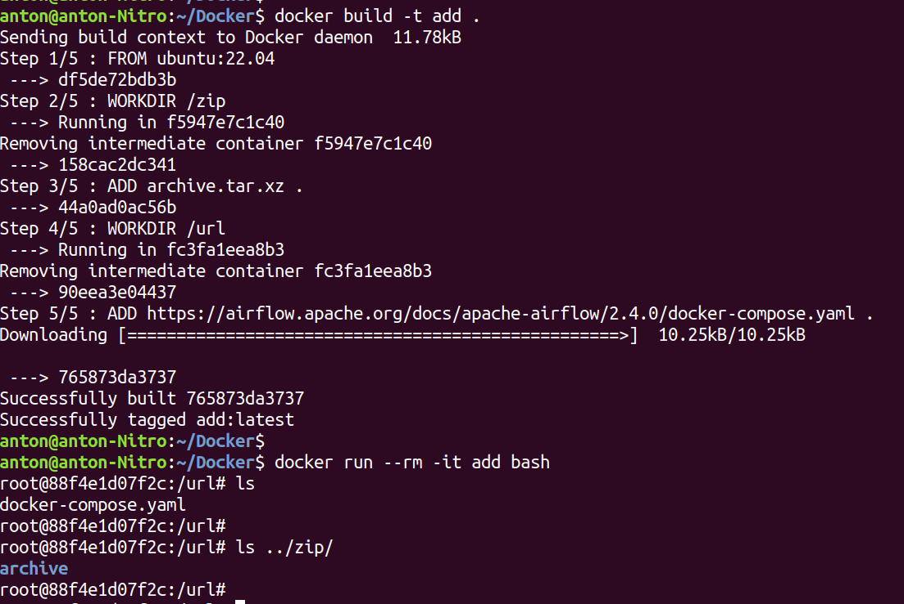
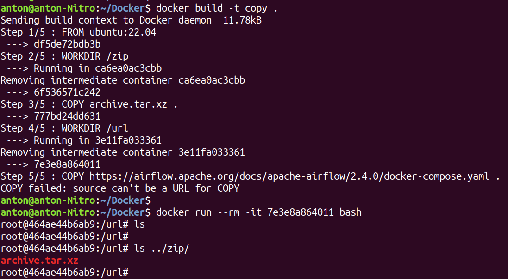
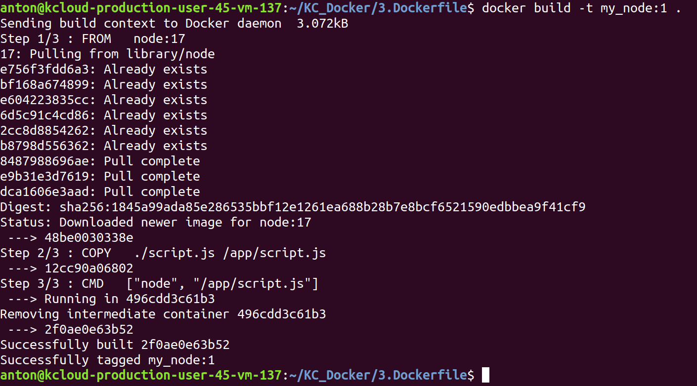
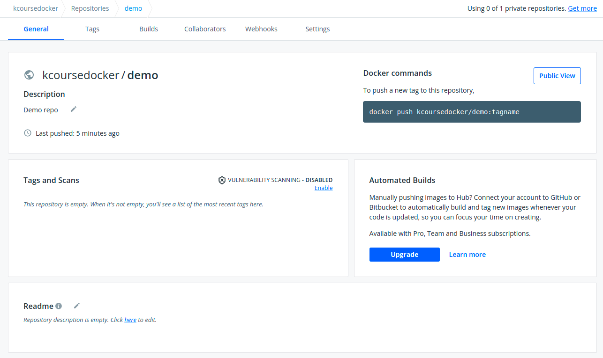
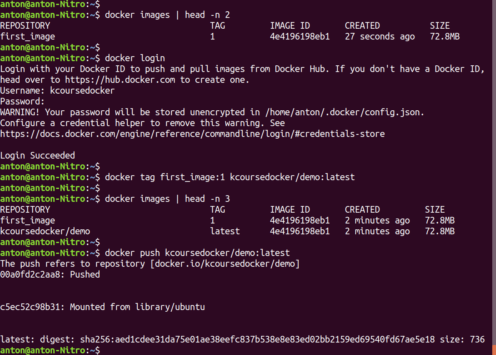
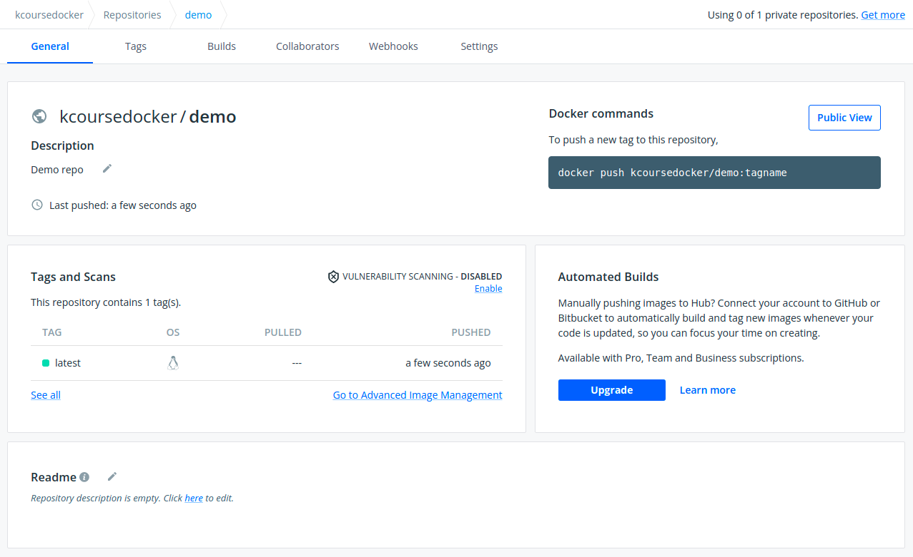
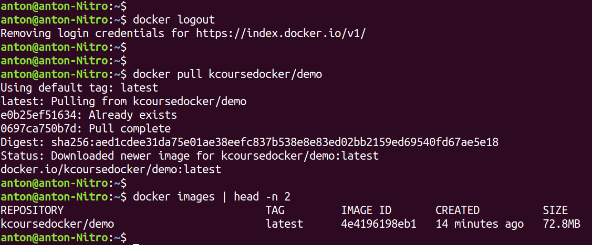

# ✅ Creating an IMAGES. Your repository

## Инструкции Dockerfile'а

```
FROM — задаем базовый образ, на основе которого собираем новый (ссылка)
COPY — копируем файл с нашей файловой системы в файловую систему контейнеров (ссылка)
ADD — добавляем файл или ссылку с нашей файловой системы в образ (ссылка)
RUN — выполняем команду (ссылка)
WORKDIR — устанавливаем рабочую директорию (ссылка)
ENTRYPOINT — задаем точку входа для запуска контейнера (ссылка)
CMD — задаем точку входа для запуска контейнера (ссылка)
```

## Разница в использовании ENTRYPOINT и CMD

Несмотря на то, что и ENTRYPOINT, и CMD отвечают за запуск программы в контейнере, они используются в разных ситуациях. Особенно это касается случая, когда в одном докерфайле используются обе инструкции одновременно.

|                             | No ENTRYPOINT                | ENTRYPOINT exec\_entry p1\_entry | ENTRYPOINT \[“exec\_entry”, “p1\_entry”]           |
| --------------------------- | ---------------------------- | -------------------------------- | -------------------------------------------------- |
| No CMD                      | error, not allowed           | /bin/sh -c exec\_entry p1\_entry | exec\_entry p1\_entry                              |
| CMD \[“p1\_cmd”, “p2\_cmd”] | p1\_cmd p2\_cmd              | /bin/sh -c exec\_entry p1\_entry | exec\_entry p1\_entry p1\_cmd p2\_cmd              |
| CMD exec\_cmd p1\_cmd       | /bin/sh -c exec\_cmd p1\_cmd | /bin/sh -c exec\_entry p1\_entry | exec\_entry p1\_entry /bin/sh -c exec\_cmd p1\_cmd |

## Разница в использовании ADD и COPY

Рассмотрим разницу в использовании на двух примерах — добавление архива и файла по ссылке.

### Dockerfile для ADD:

```
FROM ubuntu:22.04

WORKDIR /zip
ADD archive.tar.xz .

WORKDIR /url
ADD https://airflow.apache.org/docs/apache-airflow/2.4.0/docker-compose.yaml .
```

<figure><figcaption><p>При использовании ADD архив распаковался, а файл (в данном случае docker-compose.yaml) по ссылке скачался.</p></figcaption></figure>

### Dockerfile для COPY:

```
FROM ubuntu:22.04

WORKDIR /zip
COPY archive.tar.xz .

WORKDIR /url
COPY https://airflow.apache.org/docs/apache-airflow/2.4.0/docker-compose.yaml .
```

<figure><figcaption><p>При использовании COPY файл по ссылке скачивать нельзя, поэтому упали с ошибкой. При этом архив не распаковался.</p></figcaption></figure>

## Команда для сборки

```
docker build <путь, где лежит Dockerfile> — создать образ на основе Dockerfile
 - docker build -t <имя_образа:тег> <путь> — создать образ с именем и тегом
```

Пример создания образа:

<figure><figcaption></figcaption></figure>

## Собственные образы на Docker Hub

### Регистрация на Docker Hub

1. Для начала заходим на сам сайт Docker Hub (https://hub.docker.com/).
2. Нажимаем кнопку Register.
3. Там нужно ввести 3 значения — Docker ID, Email и Password. Docker ID — можно назвать логином. Он будет составлять часть названия образа (см.ниже)
4. Нажимаете галочки, затем Sign Up.
5. На почту придет уведомление. Нужно подтвердить ваш адрес.
6. Заходите на Docker Hub под созданным пользователем.

### Создание своего репозитория

После того, как вы зарегистрировались, необходимо создать репозиторий (прямо как на GitHub).

На странице вы увидите плашку Create a Repository. Нажмите на неё.

После нажатия вы попадете на страницу создания репозитория. Создайте там свой репозиторий.

Отлично! Теперь у вас есть свой репозиторий, где можно хранить свои образы.

### Команды для работы с репозиторием

После того, как у вас появился репозиторий, попробуйте загрузить в него свой образ.

Чтобы это сделать, необходимо локально авторизоваться, при необходимости сменить имя и тег образа и сделать пуш на Docker Hub.

1.  Для локальной авторизации используется команда:

    ```
     docker login.
    ```
2.  Чтобы сменить название образа и тег, нужно воспользоваться командой:

    ```
     docker tag <исходный_образ> <результирующий_образ>
    ```
3. В названии результирующего образа будет присутствовать ваш username, слеш (/), название репозитория.
4.  Чтобы отправить образ на Docker Hub, нужно ввести команду:

    ```
     docker push <образ>
    ```
5.  Чтобы локально разлогиниться, нужно ввести команду:

    ```
     docker logout.
    ```

Выглядеть это будет как-то так:

<figure><figcaption></figcaption></figure>

<figure><figcaption></figcaption></figure>

<figure><figcaption></figcaption></figure>

## Скачивание образа

После того, как вы загрузили образ на Docker Hub, вы можете его скачать. Как вы уже знаете, делается это командой:

```
docker pull
```

<figure><figcaption></figcaption></figure>
